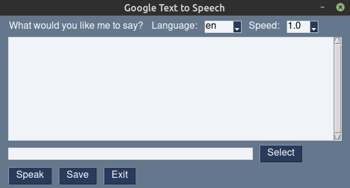
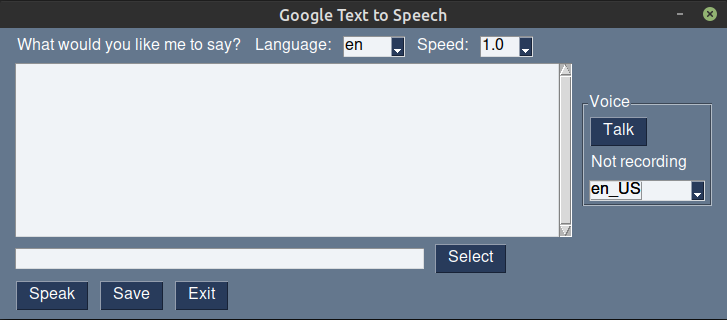

# GUI for gTTS

This is a GUI for [gTTS](https://github.com/pndurette/gTTS) created using [PySimpleGUI](https://pysimplegui.readthedocs.io). gTTS is a Python package that allows the use of Google's Text-to-Speech service. The GUI allows you to enter the text to be converted to speech, the language for the speech/text, and also the option to save the output to a file. You can also speed up the speech (1.25 or 1.5 times) because the default speed can sound a bit slow. The audio playback uses the [pydub](https://github.com/jiaaro/pydub) package. An improved GUI has also been added to allow speech-to-text input using the [SpeechRecognition](https://github.com/Uberi/speech_recognition) Python package.

### Basic GUI


### Improved GUI


## Requirements
```
gTTS
pydub
PySimpleGUI
```
Additional requirements for improved GUI:
```
SpeechRecognition
pyaudio
```

## Usage
To use the basic GUI:
```
python3 gtts-gui.py
```
To use the improved GUI, which allows voice input:
```
python3 improved-gtts-gui.py
```
The improved GUI requires the SpeechRecognition and PyAudio packages.

To install SpeechRecognition package:
```
pip3 install SpeechRecognition
```
To install PyAudio, please see this [link](https://github.com/Uberi/speech_recognition#pyaudio-for-microphone-users).

The list of voice input languages can be expanded by adding more language tags to the `voice_lang` list in `improved-gtts-gui.py`. For the tags that can be used, refer to this [page](https://cloud.google.com/speech-to-text/docs/languages).

### Additional notes for Windows
For `pydub` to properly function, install `simpleaudio` and `ffmpeg` and make sure `ffmpeg` is in your path. You will need to edit your environment variables to add the `ffmpeg` folder to the path. See "[How to Install FFmpeg on Windows](https://www.wikihow.com/Install-FFmpeg-on-Windows)". `simpleaudio` can be install using `pip` by `pip install simpleaudio`.

Also, on Windows, you may need to download the Visual Studio build tools in order to install some packages. You can download the build tools from [here](https://visualstudio.microsoft.com/visual-cpp-build-tools/). Instructions can be referred from [here](https://stackoverflow.com/a/49986365).
## Limitations

Currently, the voices available are limited to whatever voice is available for that language on Google's service.